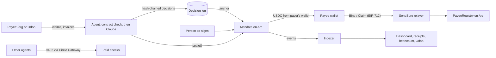

# SendSure

SendSure is a payables agent for teams that pay contractors in stablecoins. It pays only a payee
who has proven their own payout address, only for a claim that payee signed, and only inside a
budget an Arc contract enforces. Then it writes each payment into the books the team already keeps.

**Live on Arc testnet:** https://sendsure.0xpankaj.workers.dev

Built during the **Tameion Agents Hackathon** (Canteen × Circle × Arc), Sep 27 – Oct 10, 2026, on
Arc testnet (chain 5042002). Testnet only; not audited.

**What's real and what's sandbox.** The contracts, the payments and the Odoo records are all real
Arc testnet transactions. Activity from our own tests runs on *sandbox* orgs and is never counted as
traction; our own team's org is labelled *first-party*. The [dashboard](https://sendsure.0xpankaj.workers.dev/dashboard)
keeps the three apart, from chain events alone.

## For judges: a 3-minute tour

1. [`/try`](https://sendsure.0xpankaj.workers.dev/try): the whole story with no wallet. A payee proves their address, a look-alike and a forged claim are refused on-chain, a real payment is co-signed and paid, and Claude holds an inbox of tricky claims with reasons.
2. Open a payment's [receipt](https://sendsure.0xpankaj.workers.dev/receipt?tx=0xcfbb0de697f5a1349997b798de2443e358844ad39b47eb26a36553bd3128e89e): the payee's proof of address, their signed claim, and the agent's anchored decision (a sandbox payment from our tests).
3. [`/dashboard`](https://sendsure.0xpankaj.workers.dev/dashboard): every number counted from chain events, with external, first-party and sandbox kept apart.
4. Books: [`/books`](https://sendsure.0xpankaj.workers.dev/books) shows every format and lets you download the demo org's ledger. In the repo: [the Odoo add-on](integrations/odoo) and [the ERPNext app](integrations/erpnext) (screenshots and a one-command Docker setup each), and the same payments as [beancount](deployments/books-e2e.beancount) and [hledger](deployments/books-e2e.journal), each reconciled to the chain.
5. With no keys at all: `forge test` in [`contracts/`](contracts/), `pnpm test`, `integrations/odoo/run.sh test`, and `claude mcp add --transport http sendsure https://sendsure.0xpankaj.workers.dev/api/mcp`.

## Traction so far

Honest numbers on Sep 30 (live, always current: [`/dashboard`](https://sendsure.0xpankaj.workers.dev/dashboard), [`/api/stats`](https://sendsure.0xpankaj.workers.dev/api/stats)):

| Tier | Orgs | Payments | Notes |
|---|---|---|---|
| External (outside teams) | 0 | 0 | Outreach started Sep 30. |
| First-party (our own team, real wallet) | 1 | 0 | Set up through the real MetaMask flow. |
| Sandbox (our tests, never counted) | 36 | 21 (4.8 USDC) | Throwaway keys; every run record is in [`deployments/`](deployments/). |

Paid agent calls over Circle Gateway (x402): 8, all first-party.

## Try it

| How | What you see |
|---|---|
| [`/try`](https://sendsure.0xpankaj.workers.dev/try), no wallet | In two minutes: a payee proves their address, a look-alike address is caught, an attacker's claim is refused on-chain, a "pay my new wallet" change is refused, a real payment is escalated, co-signed and paid, then an inbox of tricky claims (a duplicate under a new number, an undescribed claim, a hidden instruction to the AI) that Claude holds with reasons. Receipt and books included. |
| [`/check?example`](https://sendsure.0xpankaj.workers.dev/check?example) | The free payout check: compares your payout CSV with the last one you paid (changed, new, look-alike, duplicate, amount jumps). It runs in your browser; nothing is uploaded. |
| [`/org`](https://sendsure.0xpankaj.workers.dev/org) | Set up a team: create the org, set a budget, invite payees, run the agent or turn on autopilot, co-sign, download books. You only sign; SendSure pays the gas. |
| [`/books`](https://sendsure.0xpankaj.workers.dev/books) | The books, exact to the last decimal: Odoo, beancount, hledger, journal CSV and statement CSV. Download the demo org's ledger in each format. |
| MCP, for your agent | `claude mcp add --transport http sendsure https://sendsure.0xpankaj.workers.dev/api/mcp` |
| [Odoo add-on](integrations/odoo), for your books | Odoo 19: "Pay with SendSure" on a vendor bill. Odoo trusts only the wallet the vendor proved, and each Arc payment is recorded back through Register Payment, exactly, with the tx in the memo. `./run.sh up` in `integrations/odoo`. |
| [ERPNext app](integrations/erpnext), for your books | ERPNext 15: "Pay with SendSure" on a purchase invoice. The supplier's proven address is read from SendSure and cannot be typed in; only an Accounts Manager approves it; each Arc payment is recorded as a Payment Entry with the transaction as its reference, exactly, once. `./run.sh up` in `integrations/erpnext`. |
| Pay per call, for agents | [`/api/x402`](https://sendsure.0xpankaj.workers.dev/api/x402): verify a payee ($0.001) or check a payout file ($0.005), paid in USDC with x402 over Circle Gateway. `circle services pay https://sendsure.0xpankaj.workers.dev/api/x402/verify-payee -X POST -d '{"org":"0x…","address":"0x…"}' --address <your agent wallet> --chain ARC-TESTNET --max-amount 0.001` |
| [`/dashboard`](https://sendsure.0xpankaj.workers.dev/dashboard) | Every number counted from chain events, in three tiers. Sandbox activity is never counted as traction. |

## How it works



1. **The payee proves their address, once.** The payer sends an invite link. The payee signs an
   EIP-712 `Bind` with the wallet they want to be paid to; SendSure's relayer submits it.
2. **The payee signs a claim for each invoice.** Or the payer uploads the invoice (text or a photo)
   and Claude reads it, quoting where each value came from; the payee checks it and signs. The
   server salts the invoice number (`refHash`), runs the contract's own `check()` and stores the
   signed claim.
3. **The agent runs.** Rules first (the `check()` result plus red flags from the payee's history),
   then Claude (Opus 5.5 via MeshAPI, one key with Sonnet 5 as fallback) reviews with read-only tools. The model
   can only make a decision more careful. Every decision is hash-chained; its hash goes into the payment; the log head is
   anchored on-chain.
   - **Cash plan.** The contract checks each claim alone. When the claims to pay do not fit together in what the
     treasury can pay right now (its balance, capped by the allowance), the agent pays the oldest work first and holds
     the rest with the exact amount that is short, instead of letting payments fail on-chain.
   - **Autopilot.** The owner can let the agent run on its own. Every minute a cron re-reads each open claim's
     `check()`, whether a person co-signed, and the funds; the agent runs (and the model is asked) only when one of
     those changed. It gets no new power: the same budget, co-sign rules and cash plan apply.
4. **A person co-signs** first payments to a new address, payer-vouched addresses and amounts
   above the threshold, on-chain, for that exact claim.
5. **The agent pays** with `settle()`: on the live site, SendSure's server agent key; from the
   command line, the Circle agent wallet ([`scripts/agent-circle.ts`](scripts/agent-circle.ts), used in
   the [circle run](deployments/circle-e2e.json)). Either way the contract re-checks everything and
   moves USDC from the payer's own wallet through a capped allowance; neither agent can pay outside it.
6. **Receipts and books.** A public receipt per payment, and beancount books reconciled to the
   treasury's on-chain balance.

## What does what

| Part | What it does | File |
|---|---|---|
| PayeeRegistry | Payees prove their own address; a change needs the old key **and** the new key, then a cooldown. | [`contracts/src/PayeeRegistry.sol`](contracts/src/PayeeRegistry.sol) |
| Mandate | One per business. `settle()` is the only code that moves money; `check()` is the same rules as a dry run. | [`contracts/src/Mandate.sol`](contracts/src/Mandate.sol) |
| MandateFactory | Creates each business's Mandate (EIP-1167 clone). Only factory-made orgs count anywhere. | [`contracts/src/MandateFactory.sol`](contracts/src/MandateFactory.sol) |
| Payout check | Changed / new / look-alike / duplicate / amount-jump detection, in the browser. | [`packages/core/src/payoutCheck.ts`](packages/core/src/payoutCheck.ts) |
| Relayer | Checks each signature offline, simulates, then submits; per-address limits count only verified requests. | [`apps/web/lib/relayer.ts`](apps/web/lib/relayer.ts), [`orgRelay.ts`](apps/web/lib/orgRelay.ts) |
| Claims | Salted invoice refs, the contract's dry run before storing, one open claim per invoice. | [`apps/web/lib/claims.ts`](apps/web/lib/claims.ts) |
| Agent | Rules, red flags, the MeshAPI tool loop, settle and anchor. | [`apps/web/lib/agent.ts`](apps/web/lib/agent.ts), [`llm.ts`](apps/web/lib/llm.ts) |
| Cash plan | Fits the claims to pay into what the treasury can pay now: oldest work first, the rest waits with the amount short. Pure code, no model. | [`apps/web/lib/cash.ts`](apps/web/lib/cash.ts) |
| Autopilot | Owner opt-in. The cron runs the agent only when a claim's on-chain state, a co-sign or the funds changed; at most one run per org every two minutes. | [`apps/web/lib/autopilot.ts`](apps/web/lib/autopilot.ts), [`worker.ts`](apps/web/worker.ts) |
| Invoice reading | Two passes: every field with a verbatim quote (checked in code), then a validated claim proposal; payment instructions in an invoice are flagged, never used. | [`apps/web/lib/invoices.ts`](apps/web/lib/invoices.ts) |
| Decision log | Hash chain, anchors, and replay without the model. | [`decisionLog.ts`](apps/web/lib/decisionLog.ts), [`replay.ts`](apps/web/lib/replay.ts) |
| Circle agent wallet runner | Signs in as the Circle agent wallet (ERC-1271), sends `settle()` and `anchor()` with `circle wallet execute`. | [`scripts/agent-circle.ts`](scripts/agent-circle.ts) |
| Books | Beancount, hledger, journal CSV and statement CSV from one list of movements: each payment with its claim, decision hash and Arc tx; daily balances from the chain; six decimals, never rounded. | [`packages/core/src/beancount.ts`](packages/core/src/beancount.ts), [`ledgers.ts`](packages/core/src/ledgers.ts), [`apps/web/lib/books.ts`](apps/web/lib/books.ts) |
| Indexer and dashboard | Chain events into D1 (≤ 9,999-block windows); three tiers; public receipts. | [`indexer.ts`](apps/web/lib/indexer.ts), [`stats.ts`](apps/web/lib/stats.ts), [`receipt.ts`](apps/web/lib/receipt.ts) |
| Odoo add-on | Odoo only lets a person trust a vendor wallet that is the address the vendor proved. Bills go to SendSure. Settlements are recorded exactly (half a cent is never rounded away), and a USDC payment without an Arc tx is refused. | [`integrations/odoo/`](integrations/odoo/) |
| ERPNext app | The same guarantees for ERPNext 15: a read-only proven address (typing another is refused for everyone), four-eyes approval, a Payment Entry on the SendSure mode only for a settlement SendSure read from Arc, exact recording with the ledger rows read back. Reproduces what stock ERPNext does with half a cent. | [`integrations/erpnext/`](integrations/erpnext/) |
| Integration keys | Owner-created, hashed and revocable. A key can send bills and read their status, never approve or co-sign. | [`apps/web/lib/integrations.ts`](apps/web/lib/integrations.ts) |
| Paid checks (x402) | Other agents pay per call through Circle Gateway: a 402 with the price, then verify and settle with Circle's facilitator; the check runs before the charge, so bad input is never billed. Each payment is recorded and counted on the dashboard. | [`apps/web/lib/x402.ts`](apps/web/lib/x402.ts), [`app/api/x402/`](apps/web/app/api/x402/) |
| MCP server | Payout check, address lookup, receipts, stats, and a sandbox-only, dry-run-by-default demo tool. | [`apps/web/lib/mcp.ts`](apps/web/lib/mcp.ts) |
| Schema | Cloudflare D1 (the same SQL runs on local SQLite for tests). The payee list with names stays in the payer's browser; the one exception is an invoice the payer asks SendSure to read, whose fields (which can include the issuer's name) are kept with it. Details: [/data](https://sendsure.0xpankaj.workers.dev/data). | [`apps/web/migrations/`](apps/web/migrations/) |

## Circle and Arc, with proof

| Surface | How SendSure uses it | Proof |
|---|---|---|
| Circle CLI agent wallet (Agent Stack) | The Circle agent wallet is an agent of every org: it sends `settle()` and `anchor()` itself, and signs in to SendSure with an ERC-1271 signature. | [circle run](deployments/circle-e2e.json) (settle, anchor, replay), [smoke test](deployments/smoke-test.md) |
| Circle Gateway Nanopayments (x402) | SendSure sells its checks to other agents: $0.001 per payee verification, $0.005 per payout-file check, paid in USDC through Gateway (gasless for the buyer, batched settlement; Arc testnet and 11 other testnets accepted). | [x402 run](deployments/x402-e2e.json): unpaid 402, `circle services inspect`, estimate, two paid calls settled by Gateway, dashboard count |
| USDC on Arc | Payouts are USDC; gas is USDC; budgets are EIP-2612 `permit`s, so payers never need gas to onboard. | [org run](deployments/org-e2e.json) (budget by permit), permit domain checked against the token in [`org.test.ts`](packages/chain/test/org.test.ts) |
| USDC blocklist | Blocklisted addresses cannot bind or be paid; a blocklisted treasury cannot pay. | `isBlacklisted` in the contracts; `test_BlocklistedAddressCannotBind` |
| Arc testnet | Contracts deployed and source-verified; archive state lets replay re-run `check()` at the recorded block. | [`deployments/arc-testnet.json`](deployments/arc-testnet.json) |
| Circle Wallets (developer-controlled) | Next: the hosted agent settles through a Circle wallet so no laptop is needed. | not yet |

## Who can move money

| Who | Can | Cannot |
|---|---|---|
| Treasury (the payer's own wallet) | Holds the money; sets or revokes the Mandate's allowance. | Be paid by its own Mandate. |
| Owner | Set caps, agents and approvers; open invites; freeze or revoke payees; pause. | Change a payee's address, or sign a payee's claim. |
| Approver | Co-sign one exact claim; pause; freeze; cancel a pending address change. | Send money. |
| Agent (Circle agent wallet, SendSure server agent) | Call `settle()`, which pays only if every rule passes; anchor the log; open invites. | Change caps, payees or addresses; pay an unproven address or an unsigned claim; skip a required co-sign. |
| Payee | Prove their address; sign claims; change address with both keys and a waiting period. | Get paid outside the caps, the allowance or a required co-sign. |
| Relayer key | Pay gas for signatures that it checked. | Anything else: it has no role in any contract. |
| The model (Claude via MeshAPI) | Hold or escalate a claim, with reasons. | Pay, add payees, change amounts, or overrule a person's co-sign. |
| Autopilot (the scheduler) | Decide when the agent runs, for orgs whose owner turned it on; an approver can turn it off. | Anything the agent cannot: it only starts the same run a person would. |

The worst case for a stolen agent key is bounded by the allowance the treasury granted, paid only
to addresses payees proved, for claims they signed, with first payments waiting for a person.

## Threat model

| Attack | What stops it | Where to see it |
|---|---|---|
| Address poisoning (a look-alike in the payout list) | The payout check flags it; the contract only pays the address the payee proved. | `/try` step 2; [`payoutCheck.test.ts`](packages/core/test/payoutCheck.test.ts) |
| "Please pay my new wallet" (business email compromise) | A change needs the old key and the new key, then a cooldown the payer can cancel; the agent holds claims that ask for it. | [change run](deployments/relay-e2e-change.json), [agent run](deployments/agent-e2e.json) #3 |
| A wallet slipped onto a vendor in the books (Odoo, ERPNext) | Odoo refuses to trust any wallet except the address the vendor proved, even for the admin; the SendSure journal pays only trusted wallets, and only through SendSure. ERPNext refuses a typed address for every user and lets only an Accounts Manager approve the proven one. | [odoo run](deployments/odoo-e2e.json) (refused: slipped-in wallet, agent user trusting, send before trust), [erpnext run](deployments/erpnext-e2e.json) |
| Books silently absorb a rounding difference | A settlement is recorded in Odoo or ERPNext only if it equals the open amount to 6 decimals; otherwise it stays open for a person. A claim must match its bill's amount. | `test_half_a_cent_is_not_rounded_away` (both apps), `test_stock_erpnext_marks_a_half_cent_short_payment_paid`, [odoo run](deployments/odoo-e2e.json) (`PROPOSAL_MISMATCH`) |
| Forged invoice | A claim must be signed by the payee's proven key (EIP-712, bound to the org and the chain); the contract refuses others on-chain. | [claim run](deployments/claim-e2e.json), `/try` step 2 (Refused `BAD_SIGNATURE`) |
| Duplicate invoice | The salted invoice ref makes one obligation, paid once; one open claim per invoice; the agent flags repeated amounts and overlapping periods. | `DUPLICATE_REF` tests; [`agent.test.ts`](apps/web/test/agent.test.ts) |
| Prompt injection in claim text | Claim text is data; the model can only be more careful; rules flag "ignore previous rules", "urgent", "new wallet". | [`agent.test.ts`](apps/web/test/agent.test.ts) |
| Leaked invite link | The first payment to a new address needs a person; the real payee sees "already confirmed" and tells the payer, who can freeze it. | [`Mandate.t.sol`](contracts/test/Mandate.t.sol) |
| Edited decision log | The chain breaks against the on-chain anchors; replay re-checks from the chain. | [agent run](deployments/agent-e2e.json) (replay), `verifyChain` test |
| Look-alike contract emitting `Settled` | Receipts and the dashboard only count orgs the SendSure factory created. | [`receipt.ts`](apps/web/lib/receipt.ts) |
| Replayed signatures | Per-signer nonces, expiries, EIP-712 domains with chain id and contract. | registry and relayer tests |

Known limits: testnet only; not audited; an invite link works for whoever uses it first (the
first-payment co-sign is the backstop); rate limits live in each Worker isolate; the hosted agent
settles with a server key, not yet a Circle wallet; payout addresses are EVM only; the cash plan covers
the treasury's balance and allowance, while the period caps are still enforced claim by claim by the contract.

What comes next, with dates: [ROADMAP.md](ROADMAP.md).

## Prior art, and what's different

- Banks have Confirmation of Payee (UK) and Verification of Payee (EU), which check the name on an
  account before a transfer. SendSure applies the idea to stablecoin payouts, and the payee proves
  the address with their own key.
- Multisigs and allowlists control who approves and where money may go, but the address itself
  still comes from the payer's list.
- What SendSure adds is the combination, enforced by a contract: a payee-proven address, a
  payee-signed claim, a capped budget with a person's co-sign where it matters, an agent whose
  every decision is hash-chained and anchored, and books reconciled to the chain.

## Tests and live runs

- Contracts: 47 tests (`forge test` in [`contracts/`](contracts/)): 30 Mandate, 14 registry, 3 invariants.
- TypeScript: 74 tests (`pnpm test`): payout check and books (23), chain helpers with live
  cross-checks against the deployed contracts (16), web server (35).
- Odoo add-on: 14 tests (`integrations/odoo/run.sh test`), run inside Odoo 19.
- ERPNext app: 25 tests (`integrations/erpnext/run.sh test`), run inside ERPNext 15, including three that record what stock ERPNext does on its own.
- Live runs against the deployed site, with throwaway keys on sandbox orgs (not traction):
  [bind](deployments/relay-e2e.json) 4/4, [change](deployments/relay-e2e-change.json) 7/7,
  [org](deployments/org-e2e.json) 9/9, [claim](deployments/claim-e2e.json) 11/11,
  [agent](deployments/agent-e2e.json) 13/13 (with the model's reasons, and its books checked by `bean-check` and `hledger`),
  [autopilot](deployments/autopilot-e2e.json) 9/9 (nobody pressed run: the agent woke for a new claim, a co-sign and a
  top-up, stayed asleep while nothing changed, and when 0.56 USDC was due with 0.49 in the treasury it paid the older work
  and held the rest), [circle](deployments/circle-e2e.json) 10/10,
  [try](deployments/try-e2e.json) 10/10, [invoice](deployments/invoice-e2e.json) 12/12,
  [x402](deployments/x402-e2e.json) 11/11 (our Circle agent wallet paying through Gateway),
  [odoo](deployments/odoo-e2e.json) 25/25 (a real Odoo 19 bill paid on Arc and recorded back exactly),
  [erpnext](deployments/erpnext-e2e.json) 29/29 (a real ERPNext 15 purchase invoice paid on Arc and recorded back exactly);
  the books of the agent run pass `bean-check` ([beancount](deployments/books-e2e.beancount)) and `hledger check --strict`
  ([journal](deployments/books-e2e.journal)), with the same payments as [journal CSV](deployments/books-e2e.journal.csv)
  and [statement CSV](deployments/books-e2e.statement.csv). Each run record lists every check it
  made under `checks` (`passed`, `total`, and each check by name), so these counts can be recounted.

## Run it

```bash
pnpm install && pnpm gen && pnpm typecheck && pnpm test
pnpm --filter @sendsure/web dev                    # local; needs apps/web/.env.local (see PLAN.md)
pnpm --filter @sendsure/web cf:deploy              # Cloudflare Workers + D1
pnpm e2e:agent --base https://sendsure.0xpankaj.workers.dev   # needs throwaway keys in .env (see PLAN.md)
```

## What existed before the hackathon

Everything in [`prior-work/`](prior-work/) existed before the window opened (Sun Sep 27, 00:00 ET)
and is **not** Tameion work. The first commit, tagged `tameion-baseline`, contains only those files.
[`BASELINE.md`](BASELINE.md) lists each one with its date and sha256.

Only the work done during the hackathon:
https://github.com/0x-pankaj/sendsure/compare/tameion-baseline...main

## Licences

MIT (see [`LICENSE`](LICENSE)), except:
- `prior-work/horos-spike/` keeps the AGPL-3.0-only headers it was written with.
- `prior-work/odoo-usdc-repro/addons/usdc_arc_gate/` and `integrations/odoo/sendsure_payables/` are LGPL-3, as their manifests say (Odoo add-ons).
