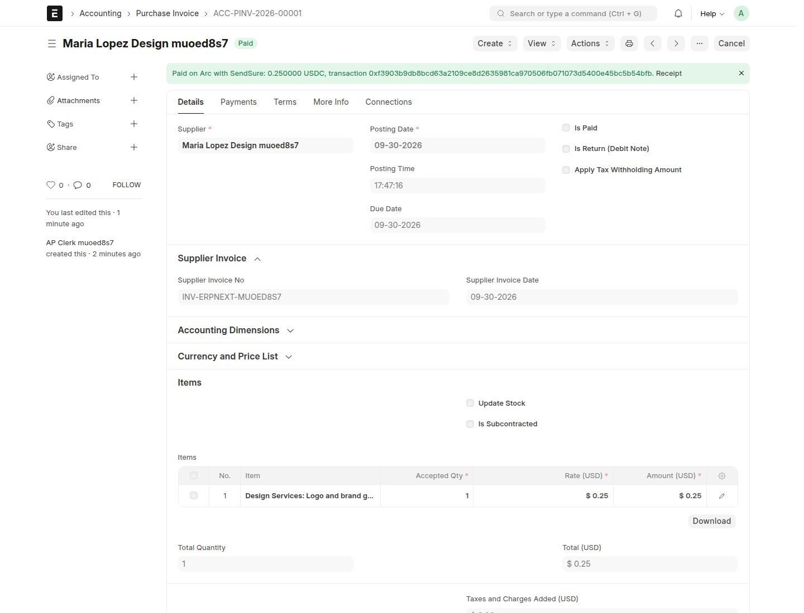
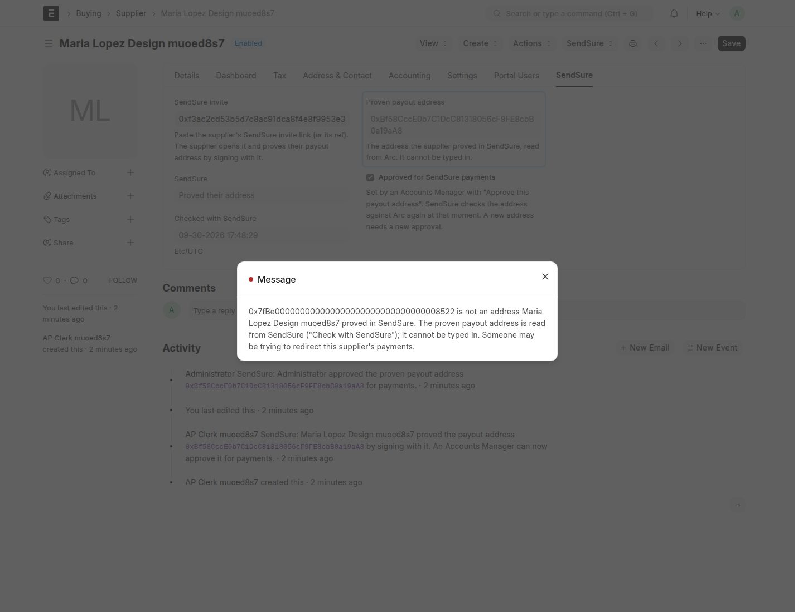

# SendSure for ERPNext

`sendsure_erpnext` is a Frappe app for ERPNext 15 (GPL-3.0, like ERPNext). It lets you pay purchase
invoices in USDC on Arc from your own wallet. It pays only to an address the supplier proved by signing
with it, and records each payment back in ERPNext with the exact amount and the Arc transaction.

Built and tested on `frappe/erpnext:v15.121.6` (ERPNext 15.121.6, Frappe 15.121.2). Testnet only; not audited.



## Why it exists

A ledger checks that debits equal credits. A payment to the wrong wallet balances perfectly, and so does
a payment that is half a cent short. We checked what ERPNext does on its own, then wrote the app around
what we saw. Each row below is a test in [`tests/test_sendsure.py`](sendsure_erpnext/sendsure_erpnext/tests/test_sendsure.py)
that runs inside ERPNext.

| ERPNext alone | With this app |
|---|---|
| A 250.00 invoice paid with 249.995 is marked Paid. The Payment Entry keeps 249.995, both ledger rows say 250.00, and there is no Round Off row and no write-off. | A settlement is recorded only if it equals the open amount exactly, to the last of 6 decimals. Anything else is left open with a comment, never rounded. |
| Amounts have one precision for the whole site (2 decimals as installed). A currency's own number format stops at 3 decimals. | The app does not change that setting. It reads amounts from the database as decimals and records only exact matches, so it is exact at any precision. After posting, it reads the ledger rows back and undoes the payment if they are not the settled amount. |
| The currency code `USDC` is accepted as it is. | USDC is set up with 1,000,000 units per USDC and a 1:1 rate to USD, with a "USDC on Arc (SendSure)" account that holds USDC and a mode of payment that pays from it. |
| A supplier's account number lives on a Bank Account, and Bank Account No takes 30 characters. A wallet address has 42. | The supplier's proven address is a read-only field, read from SendSure (which reads Arc). Typing another address is refused for every user, the administrator included. |
| A Payment Entry takes any text as its reference number. Nothing ties it to a transfer. | A Payment Entry on the SendSure mode of payment, or out of the USDC account, is refused unless SendSure read the settlement from Arc. "Is Paid" on an invoice with that account is refused too. |



### What ERPNext does with half a cent

On ERPNext 15.121.6 as installed, we paid a 250.00 USD purchase invoice with a Payment Entry of 249.995
(`test_stock_erpnext_marks_a_half_cent_short_payment_paid`, none of this app's code involved):

- the Payment Entry stores 249.995;
- both ledger rows are posted as 250.00;
- the invoice has 0.00 outstanding and is Paid;
- nothing is posted to the Round Off account, and there is no deduction or write-off.

The reason is in the ledger code. `get_debit_credit_difference` rounds each ledger row to the company
currency's precision before it compares debits with credits
([`general_ledger.py` L487–L505](https://github.com/frappe/erpnext/blob/v15.121.6/erpnext/accounts/general_ledger.py#L487-L505)).
Both rows become 250.00, so `process_debit_credit_difference`
([L454–L484](https://github.com/frappe/erpnext/blob/v15.121.6/erpnext/accounts/general_ledger.py#L454-L484))
sees no difference and posts no Round Off row. The invoice's outstanding amount is rounded the same way
([`utils.py` L1985–L1987](https://github.com/frappe/erpnext/blob/v15.121.6/erpnext/accounts/utils.py#L1985-L1987)).
So the books say 250.00 left the account when 249.995 did.

249.994 rounds the other way: the ledger says 249.99 and a whole cent stays open. Paid from an account
that holds USDC, the same payment is booked as 249.995 USDC valued at 250 USD
(`test_the_ledger_is_read_back_after_posting`).

ERPNext is exact when the whole site is told to be. With System Settings → Currency Precision set to 6,
the same payment posts 249.995 and leaves 0.005 open, Partly Paid
(`test_stock_erpnext_keeps_the_half_cent_at_six_decimals`). That setting is site-wide and changes how every
currency is shown, so the app does not touch it. With it on (and Rounded Total off on the invoice), the app
sends and records amounts below a cent to the last decimal
(`test_six_decimals_are_kept_when_the_site_allows_them`).

We did not see ERPNext post a Round Off row for any of these payments. Its allowance for one (5 units of
the last decimal on a payment, [L508–L514](https://github.com/frappe/erpnext/blob/v15.121.6/erpnext/accounts/general_ledger.py#L508-L514))
is never reached, because the rows are rounded first.

## How an invoice gets paid

1. **Connect.** The org's owner creates a key in SendSure (`/org` → Connect your books). In ERPNext, open
   SendSure Settings, enter the key, then click "Test connection and set up the USDC account". The key is
   stored as a Password field. It can send bills and read their status. It can never approve, co-sign, add
   payees or change the org's rules.
2. **Link the supplier.** Paste their SendSure invite link on the supplier (SendSure tab), save, then click
   SendSure → "Check with SendSure". ERPNext reads the address the supplier proved.
3. **Approve it.** An Accounts Manager clicks "Approve this payout address". SendSure checks the address
   against Arc again at that moment. Nobody else can approve, and the box cannot be ticked by editing the supplier.
4. **Pay with SendSure.** Click it on a submitted purchase invoice. The invoice needs the supplier's invoice
   number. It becomes an invoice the supplier confirms by signing it in SendSure. A claim for a different
   amount is refused. Sending the same invoice again only returns its status.
5. **The agent pays.** Every 5 minutes, a scheduled job asks SendSure's agent to pay the invoices the
   supplier signed. The agent pays only what passes your Arc contract's rules. A first payment, or a large
   one, waits until a person co-signs it on-chain in SendSure. If the agent's answer is slow, the job reads
   the status again anyway: the chain has the truth.
6. **Recorded.** Once it is paid, ERPNext makes a Payment Entry with `get_payment_entry`, the code behind
   its own Create → Payment button:
   - the exact amount from the `Settled` event on Arc;
   - paid from the "USDC on Arc (SendSure)" account;
   - the Arc transaction as the reference number, plus a link to the receipt (the supplier's proof of
     address, their signed claim and the agent's decision);
   - the supplier's proven address, read from SendSure again while the payment is validated.

   Syncing again never records the same transaction twice (a unique index on the transaction).

If the supplier later changes their address in SendSure, ERPNext withdraws the approval and logs a comment
on the supplier. A change needs both the old and the new key, plus a waiting period you can cancel. The new
address must be approved again by a person.

## Try it

You need Docker. `run.sh` does the same as `docker-compose.yml` with plain `docker` commands.

```bash
./run.sh up       # ERPNext 15 + MariaDB + Redis + the app on http://127.0.0.1:18080 (Administrator / admin)
./run.sh test     # the app's tests inside ERPNext, on a throwaway site
./run.sh down     # remove everything
```

The first `up` takes about 75 seconds once the images are there (about 4.2 GB of images, plus the site's database).

End to end against the live SendSure on Arc testnet (sandbox org, throwaway keys), from the repo root:

```bash
pnpm e2e:erpnext  # needs ./run.sh up first
```

On a bench of your own: copy `sendsure_erpnext/` into `apps/`, then `pip install -e apps/sendsure_erpnext`,
add `sendsure_erpnext` to `sites/apps.txt` and run `bench --site <site> install-app sendsure_erpnext`.

## Tests and live runs

- **ERPNext tests** (`./run.sh test`), 25 in total, in [`tests/test_sendsure.py`](sendsure_erpnext/sendsure_erpnext/tests/test_sendsure.py).
  SendSure's API is mocked; ERPNext is real.
  - USDC currency, account and mode of payment; invite-link parsing;
  - "Check with SendSure" reads the proven address, unapproved;
  - an address cannot be typed in; only an Accounts Manager approves, and only a proven address;
  - an unlinked supplier cannot be approved; an address change withdraws the approval; another invite forgets the old address;
  - "Pay with SendSure" needs an approved proven address and sends the exact decimal amount, once;
  - an invoice that is with SendSure cannot be cancelled, and a new invoice cannot claim to be sent or paid;
  - hand-made payments on the SendSure mode are refused (a plain one, one with a transaction typed in, one
    sent with forged flags, another mode of payment on the USDC account, and "Is Paid" on an invoice);
  - an exact payment is recorded once; a transaction recorded for one invoice does not pay another;
  - half a cent is not rounded away; the ledger is read back after posting;
  - a payment to another address, or after the approval is gone, is not recorded;
  - the scheduled job runs the agent and records the payment; a slow agent run is followed by a status read;
  - the client refuses plain http and reports timeouts;
  - what ERPNext does on its own (the three `test_stock_erpnext_…` tests).
- **Live run** ([`deployments/erpnext-e2e.json`](../../deployments/erpnext-e2e.json)), 29 of 29 checks passed.
  An "AP clerk" user without the Accounts Manager role linked a supplier and sent a 0.25 USD invoice. Neither
  the clerk nor the administrator could type another address onto the supplier, and the clerk could not
  approve the proven one. The supplier signed the invoice, and a claim for a different amount was refused.
  ERPNext's scheduled job ran the agent, and the payment waited for a co-sign. After the owner co-signed
  on-chain, the next run of the job paid it on Arc. ERPNext then recorded 0.25 USDC as a Payment Entry with
  the transaction as its reference, two ledger rows and nothing else, and the invoice was Paid with 0.00 left open.

## Files

| File | What it does |
|---|---|
| [`client.py`](sendsure_erpnext/sendsure_erpnext/client.py) | The SendSure API (`/api/v1/*`) with the integration key. |
| [`install.py`](sendsure_erpnext/sendsure_erpnext/install.py) | The fields the app adds, and the USDC currency, account and mode of payment. |
| [`sendsure_settings/`](sendsure_erpnext/sendsure_erpnext/sendsure/doctype/sendsure_settings) | SendSure Settings: the server, the key (a Password field) and "Test connection". |
| [`supplier.py`](sendsure_erpnext/sendsure_erpnext/supplier.py) | Links a supplier to their invite, reads the proven address, refuses a typed one, and the approval. |
| [`payment_entry.py`](sendsure_erpnext/sendsure_erpnext/payment_entry.py) | The checks in Payment Entry's `validate`: only a settlement SendSure read from Arc, to the proven address, for the exact amount. |
| [`purchase_invoice.py`](sendsure_erpnext/sendsure_erpnext/purchase_invoice.py) | "Pay with SendSure", status sync, and exact recording of each settlement. |
| [`sync.py`](sendsure_erpnext/sendsure_erpnext/sync.py) | The job ERPNext's scheduler runs every 5 minutes. |
| [`public/js/`](sendsure_erpnext/sendsure_erpnext/public/js) | The buttons on Supplier and Purchase Invoice. Every check they trigger runs on the server. |
| [`tests/test_sendsure.py`](sendsure_erpnext/sendsure_erpnext/tests/test_sendsure.py) | The 25 tests, run inside ERPNext by `./run.sh test`. |
| [`run.sh`](run.sh), [`docker/boot.sh`](docker/boot.sh), [`docker-compose.yml`](docker-compose.yml) | The Docker setup: site creation, tests, web server, worker and scheduler. |
| [`apps/web/lib/integrations.ts`](../../apps/web/lib/integrations.ts) | SendSure's side: hashed, revocable integration keys and the `/api/v1` endpoints. |

## Limits

- One SendSure org per ERPNext site. Companies that keep their books in USD; invoices in USD; whole invoices only.
- The app checks payments, not journals: a Journal Entry can still credit the USDC account (gas, or a
  transfer to a bank, is booked that way).
- The Docker setup runs ERPNext's development web server with one worker and the scheduler in one
  container. It is for trying the app and for the tests, not for production.
- Testnet only today.
