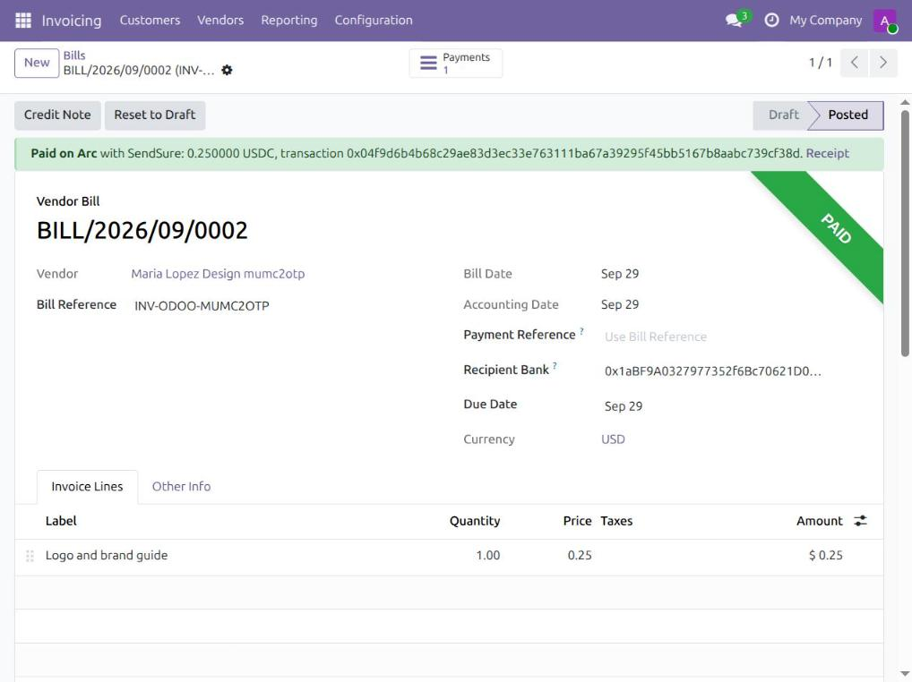
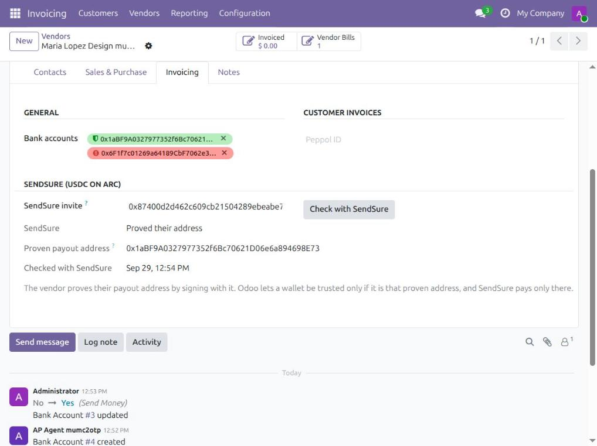

# SendSure for Odoo

`sendsure_payables` is an Odoo 19 Community add-on (LGPL-3). It lets you pay vendor bills in USDC on
Arc from your own wallet. It pays only to an address the vendor proved by signing with it, and records
each payment back in Odoo with the exact amount and the Arc transaction.



## Why it exists

A ledger checks that debits equal credits. A payment to the wrong wallet balances perfectly. Odoo
already has the right control, a "trusted account" switch (`allow_out_payment`) that only people with
the "Validate bank account" right can turn on. In Community, though, no payment method ever checks it.
And nothing checks that the wallet belongs to the vendor, not to whoever emailed it in.

We reproduced three behaviours on Odoo 19 before the hackathon
([`prior-work/odoo-usdc-repro`](../../prior-work/odoo-usdc-repro)):

| Odoo alone | With this add-on |
|---|---|
| The currency code `USDC` is cut to `USD`, which already exists. | USDC is set up as `USC` with the symbol USDC and 6 decimals, at a 1:1 rate to USD. |
| The built-in "Manual" method pays an untrusted wallet. | The SendSure journal has no Manual method. Its only way out is the SendSure method, which needs a trusted wallet, and every payment on it must carry an Arc transaction. |
| Anyone with the right can trust any wallet someone typed in. | A wallet can be trusted only if it is the address the vendor proved in SendSure, read from Arc at that moment. |
| A $250.00 bill paid with 249.995 USDC is marked paid, with no write-off. | A settlement is recorded only if it matches the open amount exactly, to the last of 6 decimals. Anything else is left open with a note, never rounded. |



## How a bill gets paid

1. **Connect.** The org's owner creates a key in SendSure (`/org` → Connect your books). In Odoo, go to
   Invoicing → Configuration → Settings → SendSure, enter the key, then click "Test connection". That
   sets up the USDC currency and journal. The key can send bills and read their status. It can never
   approve, co-sign, add payees or change the org's rules.
2. **Link the vendor.** Paste their SendSure invite link on the vendor (Invoicing tab), then click
   "Check with SendSure". Odoo reads the address the vendor proved and adds it as an untrusted wallet.
3. **Trust it.** A person with the right to validate bank accounts trusts that wallet. SendSure checks
   it again against Arc; any other wallet is refused.
4. **Pay with SendSure.** Click it on a posted bill (or on several, from the list). The bill becomes
   an invoice the vendor confirms by signing it in SendSure. A claim for a different amount is refused.
5. **The agent pays.** Every 5 minutes, a cron job asks SendSure's agent to pay the bills the vendor
   signed. The agent pays only what passes your Arc contract's rules. A first payment, or a large one,
   waits until a person co-signs it on-chain in SendSure.
6. **Recorded.** Once it is paid, Odoo registers the payment with its own Register Payment wizard:
   - the exact amount from the `Settled` event on Arc;
   - the SendSure journal;
   - the vendor's proven wallet;
   - `SendSure <tx>` as the memo, plus a link to the receipt (the vendor's proof of address, their
     signed claim and the agent's decision).

   Syncing again never records the same transaction twice (a unique constraint on the tx).

If the vendor later changes their address in SendSure, Odoo archives the old wallet and logs a note
on the vendor. A change needs both the old and the new key, plus a waiting period you can cancel. The
new wallet must be trusted again by a person.

## Try it

You need Docker. `run.sh` does the same as `docker-compose.yml` with plain `docker` commands.

```bash
./run.sh up       # Odoo 19 + Postgres + the add-on on http://127.0.0.1:18069 (admin / admin)
./run.sh test     # the add-on's Odoo tests in a throwaway database
./run.sh down     # remove everything
```

End to end against the live SendSure on Arc testnet (sandbox org, throwaway keys), from the repo root:

```bash
pnpm e2e:odoo     # needs ./run.sh up first
```

## Tests and live runs

- **Odoo tests** (`./run.sh test`), 28 in total, in [`tests/test_sendsure.py`](sendsure_payables/tests/test_sendsure.py):
  - currency and journal setup;
  - invite-link parsing;
  - only the proven wallet can be trusted;
  - an unlinked vendor's wallet cannot be trusted;
  - IBANs are left alone;
  - an address change archives the old wallet;
  - "Pay with SendSure" needs a trusted proven wallet and sends the exact decimal amount;
  - a hand-made USDC payment is refused;
  - an exact payment is recorded once;
  - half a cent is not rounded away;
  - a payment to an untrusted address is not recorded;
  - the cron job runs the agent and records the payment;
  - when the bill changes after it was sent: cancelling or resetting it withdraws it from SendSure (and it can be
    sent again after editing); a bill already paid on Arc cannot be cancelled; no hand payment while SendSure is
    paying; a payment for a bill that is no longer posted waits for a person; a transaction recorded for one bill
    is never reused for another;
  - one bill that fails to record never blocks the others; a manager can record a payment that needs review,
    and SendSure states exactly what Odoo rounded away;
  - sending several bills goes on past one refusal;
  - nobody can type an Arc transaction on a payment (UI, RPC or the wizard), and a recorded one cannot be reset;
  - a wallet created already trusted must be the proven one; a stray trusted wallet loses its trust; moving back to
    an old address needs trust again; relinking a vendor untrusts its wallets.
- **Live run** ([`deployments/odoo-e2e.json`](../../deployments/odoo-e2e.json)), 27 of 27 checks passed.
  An "AP agent" user with only the Invoicing role linked a vendor and sent a 0.25 USD bill. The admin
  could not trust a wallet that was slipped onto the vendor. The vendor signed the bill, and a claim for
  a different amount was refused. The cron job ran the agent, and the payment waited for a co-sign.
  After the owner co-signed on-chain, the next cron run paid it on Arc. Odoo then recorded 0.25 USDC
  through Register Payment with the tx in the memo, and the bill was paid with 0.00 left open.
  A second bill could not be paid by hand while it was with SendSure, and cancelling it in Odoo
  withdrew it from SendSure.

## Files

| File | What it does |
|---|---|
| [`models/sendsure_client.py`](sendsure_payables/models/sendsure_client.py) | The SendSure API (`/api/v1/*`) with the integration key. |
| [`models/res_company.py`](sendsure_payables/models/res_company.py) | Sets up USDC (`USC`, 6 decimals, 1:1 to USD) and a journal whose only way out is SendSure. |
| [`models/res_partner.py`](sendsure_payables/models/res_partner.py) | Links a vendor to their invite, syncs the proven address, archives an old wallet after a change. |
| [`models/res_partner_bank.py`](sendsure_payables/models/res_partner_bank.py) | Refuses to trust a wallet unless it is the vendor's proven address. |
| [`models/account_payment.py`](sendsure_payables/models/account_payment.py) | The SendSure payment method: needs a trusted wallet and refuses a payment without an Arc tx. |
| [`models/account_move.py`](sendsure_payables/models/account_move.py) | "Pay with SendSure", status sync, and exact recording of each settlement. |
| [`apps/web/lib/integrations.ts`](../../apps/web/lib/integrations.ts) | SendSure's side: hashed, revocable integration keys and the `/api/v1` endpoints. |

If a bill is cancelled, reset to draft or deleted after "Pay with SendSure", Odoo first withdraws it from SendSure,
so the agent never pays it. If SendSure already paid it, Odoo refuses to cancel it and records the payment instead.
While a bill is with SendSure, Register Payment refuses to pay it another way. If a payment ever cannot be recorded
automatically (a different amount, a wallet no longer trusted), the bill says why, and an accounting manager can
record the exact Arc amount with "Record SendSure payment"; any difference Odoo would round away is stated on the bill.

The SendSure API is used only by accounting users and the cron; its methods cannot be called over RPC.

One SendSure org per Odoo database. Testnet only today.
